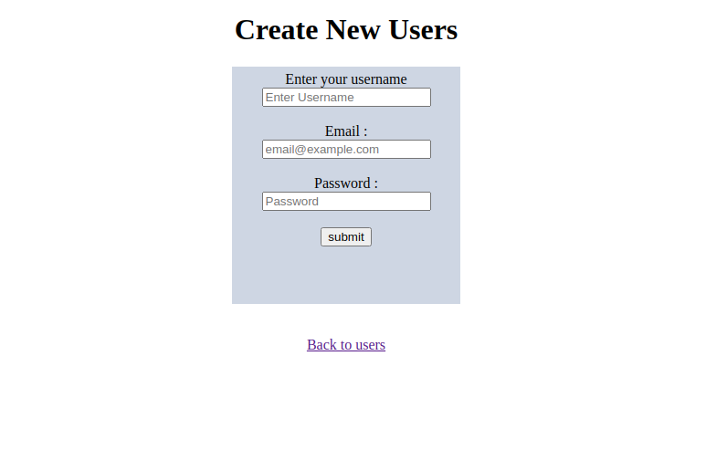

# re-former

## Description
The purpose of this project is to create rails form that allows creating new and editing an existing user. Additionally, we have added the ability to view all current users and styled the form using css. 
It allows;
- creation users
- Editing a new user



## Built With
- Major languages: Ruby 2.7.0
- css: for form styling
- frameworks: Rails 5.2.3
- technologies used: Rubocop

### Prerequisites
ruby version 2.7.0
rails version 5.2.3

### Setup
1. Clone the project
```console
git clone git@github.com:oloomoses/re-former.git
```
2. Go to the project folder
```console
cd re-former
```
3. Check out the working branch
```console
git checkout feature_one
```
4. run bundle to install all gems
```console 
bundle install
```
5. Update local database
```console
rails db:migrate
```
### Usage
Run the following command to run the project
```console
rails s
```
Run the rails console with `rails c` command
#### Creating new user
  `u1 = User.create(username: 'provide the username', email: 'user@example.com', password: '1234')`

## Validations
   #### users validations
      - username should be present

   #### email 
      - email should be present

   #### password
      - password should be present  

## Authors

👤 **Eduardo**

- Github: [@githubhandle](https://github.com/eduardoreisalvarenga)
- Twitter: [@twitterhandle](https://twitter.com/eduardodosrei11)
- Linkedin: [linkedin](https://www.linkedin.com/in/eduardo-alvarenga-44204818a/)


👤 **Oloo Moses**

- Github: [@githubhandle](https://github.com/oloomoses) 
- Twitter: [@twitterhandle](https://twitter.com/olooine)
- Linkedin: [linkedin](https://www.linkedin.com/in/oloo-moses-528bb1b3/)

## Show your support

Give a ⭐️ if you like this project!

## Acknowledgments

- Hat tip to anyone whose code was used
- Inspiration
- etc

## 📝 License

This project is [MIT](lic.url) licensed.
